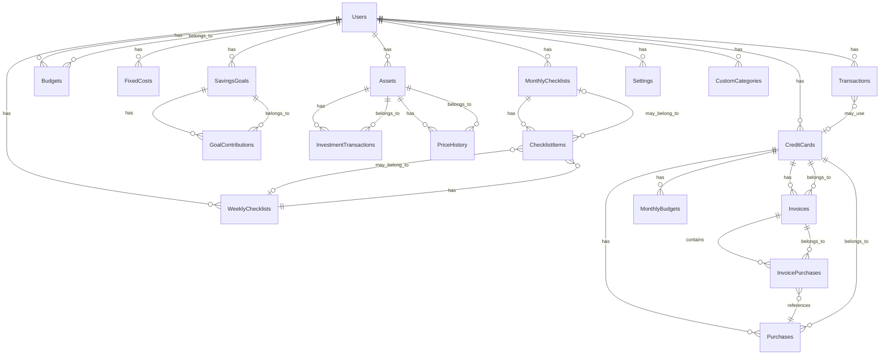

# Modelagem de Banco de Dados Relacional - My Money Control

## Visão Geral

Esta modelagem propõe uma estrutura de banco de dados relacional para o sistema de controle financeiro pessoal, baseada nas entidades identificadas no código:

- **Transactions** (receitas e despesas)
- **Credit Cards** (cartões, compras, faturas)
- **Budgets** (orçamentos por categoria)
- **Fixed Costs** (custos fixos)
- **Savings Goals** (metas de economia)
- **Investments** (ativos e transações)
- **Checklist** (checklist mensal/semanal)
- **Settings** (configurações e categorias customizadas)

## Diagrama ER

## Especificação das Tabelas

### 1. users

Tabela principal de usuários do sistema.

| Coluna | Tipo | Constraints | Descrição |

|--------|------|-------------|-----------|

| id | UUID | PRIMARY KEY | Identificador único |

| email | VARCHAR(255) | UNIQUE, NOT NULL | Email do usuário |

| name | VARCHAR(255) | NOT NULL | Nome completo |

| created_at | TIMESTAMP | NOT NULL, DEFAULT NOW() | Data de criação |

| updated_at | TIMESTAMP | NOT NULL, DEFAULT NOW() | Data de atualização |

### 2. transactions

Transações unificadas (receitas e despesas).

| Coluna | Tipo | Constraints | Descrição |

|--------|------|-------------|-----------|

| id | UUID | PRIMARY KEY | Identificador único |

| user_id | UUID | FOREIGN KEY (users.id), NOT NULL | Usuário proprietário |

| date | DATE | NOT NULL | Data da transação |

| type | ENUM('income', 'expense') | NOT NULL | Tipo: receita ou despesa |

| category | VARCHAR(50) | NOT NULL | Categoria da transação |

| value | DECIMAL(10,2) | NOT NULL | Valor da transação |

| payment_method | ENUM('pix', 'debit', 'credit-card') | NULL | Método de pagamento |

| credit_card_id | UUID | FOREIGN KEY (credit_cards.id) | Cartão usado (se aplicável) |

| notes | TEXT | NULL | Observações |

| created_at | TIMESTAMP | NOT NULL, DEFAULT NOW() | Data de criação |

| updated_at | TIMESTAMP | NOT NULL, DEFAULT NOW() | Data de atualização |

**Índices:**

- `idx_transactions_user_date` (user_id, date)
- `idx_transactions_user_type` (user_id, type)
- `idx_transactions_user_category` (user_id, category)

### 3. credit_cards

Cartões de crédito cadastrados.

| Coluna | Tipo | Constraints | Descrição |

|--------|------|-------------|-----------|

| id | UUID | PRIMARY KEY | Identificador único |

| user_id | UUID | FOREIGN KEY (users.id), NOT NULL | Usuário proprietário |

| name | VARCHAR(255) | NOT NULL | Nome do cartão |

| last_four_digits | VARCHAR(4) | NOT NULL | Últimos 4 dígitos |

| closing_day | INTEGER | NOT NULL, CHECK (1-31) | Dia de fechamento |

| due_day | INTEGER | NOT NULL, CHECK (1-31) | Dia de vencimento |

| limit | DECIMAL(10,2) | NOT NULL | Limite do cartão |

| active | BOOLEAN | NOT NULL, DEFAULT true | Se está ativo |

| created_at | TIMESTAMP | NOT NULL, DEFAULT NOW() | Data de criação |

| updated_at | TIMESTAMP | NOT NULL, DEFAULT NOW() | Data de atualização |

**Índices:**

- `idx_credit_cards_user` (user_id)
- `idx_credit_cards_active` (user_id, active)

### 4. purchases

Compras realizadas no cartão de crédito.

| Coluna | Tipo | Constraints | Descrição |

|--------|------|-------------|-----------|

| id | UUID | PRIMARY KEY | Identificador único |

| card_id | UUID | FOREIGN KEY (credit_cards.id), NOT NULL | Cartão usado |

| description | VARCHAR(255) | NOT NULL | Descrição da compra |

| amount | DECIMAL(10,2) | NOT NULL | Valor da compra |

| category | VARCHAR(50) | NOT NULL | Categoria |

| date | DATE | NOT NULL | Data da compra |

| installments | INTEGER | DEFAULT 1, CHECK (>0) | Número de parcelas |

| current_installment | INTEGER | DEFAULT 1, CHECK (>0) | Parcela atual |

| created_at | TIMESTAMP | NOT NULL, DEFAULT NOW() | Data de criação |

| updated_at | TIMESTAMP | NOT NULL, DEFAULT NOW() | Data de atualização |

**Índices:**

- `idx_purchases_card` (card_id)
- `idx_purchases_date` (card_id, date)

### 5. invoices

Faturas dos cartões de crédito.

| Coluna | Tipo | Constraints | Descrição |

|--------|------|-------------|-----------|

| id | UUID | PRIMARY KEY | Identificador único |

| card_id | UUID | FOREIGN KEY (credit_cards.id), NOT NULL | Cartão |

| month | INTEGER | NOT NULL, CHECK (1-12) | Mês (1-12) |

| year | INTEGER | NOT NULL | Ano |

| total | DECIMAL(10,2) | NOT NULL | Total da fatura |

| closing_date | DATE | NOT NULL | Data de fechamento |

| due_date | DATE | NOT NULL | Data de vencimento |

| paid | BOOLEAN | NOT NULL, DEFAULT false | Se foi paga |

| paid_at | TIMESTAMP | NULL | Data do pagamento |

| created_at | TIMESTAMP | NOT NULL, DEFAULT NOW() | Data de criação |

| updated_at | TIMESTAMP | NOT NULL, DEFAULT NOW() | Data de atualização |

**Índices:**

- `idx_invoices_card` (card_id)
- `idx_invoices_period` (card_id, year, month) UNIQUE

### 6. invoice_purchases

Relacionamento entre faturas e compras (para compras parceladas).

| Coluna | Tipo | Constraints | Descrição |

|--------|------|-------------|-----------|

| id | UUID | PRIMARY KEY | Identificador único |

| invoice_id | UUID | FOREIGN KEY (invoices.id), NOT NULL | Fatura |

| purchase_id | UUID | FOREIGN KEY (purchases.id), NOT NULL | Compra |

| installment_number | INTEGER | NOT NULL | Número da parcela |

| amount | DECIMAL(10,2) | NOT NULL | Valor da parcela |

**Índices:**

- `idx_invoice_purchases_invoice` (invoice_id)
- `idx_invoice_purchases_purchase` (purchase_id)

### 7. monthly_budgets

Orçamento mensal por cartão.

| Coluna | Tipo | Constraints | Descrição |

|--------|------|-------------|-----------|

| id | UUID | PRIMARY KEY | Identificador único |

| card_id | UUID | FOREIGN KEY (credit_cards.id), NOT NULL | Cartão |

| month | INTEGER | NOT NULL, CHECK (1-12) | Mês |

| year | INTEGER | NOT NULL | Ano |

| limit | DECIMAL(10,2) | NOT NULL | Limite do orçamento |

| created_at | TIMESTAMP | NOT NULL, DEFAULT NOW() | Data de criação |

| updated_at | TIMESTAMP | NOT NULL, DEFAULT NOW() | Data de atualização |

**Índices:**

- `idx_monthly_budgets_card` (card_id)
- `idx_monthly_budgets_period` (card_id, year, month) UNIQUE

### 8. budgets

Orçamentos por categoria.

| Coluna | Tipo | Constraints | Descrição |

|--------|------|-------------|-----------|

| id | UUID | PRIMARY KEY | Identificador único |

| user_id | UUID | FOREIGN KEY (users.id), NOT NULL | Usuário |

| category | VARCHAR(50) | NOT NULL | Categoria de despesa |

| limit | DECIMAL(10,2) | NOT NULL | Limite do orçamento |

| month | INTEGER | NOT NULL, CHECK (1-12) | Mês |

| year | INTEGER | NOT NULL | Ano |

| created_at | TIMESTAMP | NOT NULL, DEFAULT NOW() | Data de criação |

| updated_at | TIMESTAMP | NOT NULL, DEFAULT NOW() | Data de atualização |

**Índices:**

- `idx_budgets_user` (user_id)
- `idx_budgets_period` (user_id, year, month, category) UNIQUE

### 9. fixed_costs

Custos fixos e assinaturas.

| Coluna | Tipo | Constraints | Descrição |

|--------|------|-------------|-----------|

| id | UUID | PRIMARY KEY | Identificador único |

| user_id | UUID | FOREIGN KEY (users.id), NOT NULL | Usuário |

| description | VARCHAR(255) | NOT NULL | Descrição |

| amount | DECIMAL(10,2) | NOT NULL | Valor |

| type | ENUM('housing', 'health', 'subscriptions') | NOT NULL | Tipo |

| due_day | INTEGER | NOT NULL, CHECK (1-31) | Dia de vencimento |

| active | BOOLEAN | NOT NULL, DEFAULT true | Se está ativo |

| notes | TEXT | NULL | Observações |

| created_at | TIMESTAMP | NOT NULL, DEFAULT NOW() | Data de criação |

| updated_at | TIMESTAMP | NOT NULL, DEFAULT NOW() | Data de atualização |

**Índices:**

- `idx_fixed_costs_user` (user_id)
- `idx_fixed_costs_active` (user_id, active)

### 10. savings_goals

Metas de economia.

| Coluna | Tipo | Constraints | Descrição |

|--------|------|-------------|-----------|

| id | UUID | PRIMARY KEY | Identificador único |

| user_id | UUID | FOREIGN KEY (users.id), NOT NULL | Usuário |

| name | VARCHAR(255) | NOT NULL | Nome da meta |

| description | TEXT | NULL | Descrição |

| target_amount | DECIMAL(10,2) | NOT NULL | Valor alvo |

| current_amount | DECIMAL(10,2) | NOT NULL, DEFAULT 0 | Valor atual |

| target_date | DATE | NULL | Data alvo |

| start_date | DATE | NOT NULL | Data de início |

| status | ENUM('active', 'completed', 'paused', 'cancelled') | NOT NULL, DEFAULT 'active' | Status |

| type | ENUM('amount', 'percentage', 'custom') | NOT NULL | Tipo de meta |

| category | VARCHAR(50) | NULL | Categoria |

| created_at | TIMESTAMP | NOT NULL, DEFAULT NOW() | Data de criação |

| updated_at | TIMESTAMP | NOT NULL, DEFAULT NOW() | Data de atualização |

**Índices:**

- `idx_savings_goals_user` (user_id)
- `idx_savings_goals_status` (user_id, status)

### 11. goal_contributions

Contribuições para metas de economia.

| Coluna | Tipo | Constraints | Descrição |

|--------|------|-------------|-----------|

| id | UUID | PRIMARY KEY | Identificador único |

| goal_id | UUID | FOREIGN KEY (savings_goals.id), NOT NULL | Meta |

| amount | DECIMAL(10,2) | NOT NULL | Valor da contribuição |

| date | DATE | NOT NULL | Data da contribuição |

| source | ENUM('manual', 'expense_savings', 'budget_surplus') | NOT NULL | Origem |

| description | TEXT | NULL | Descrição |

| created_at | TIMESTAMP | NOT NULL, DEFAULT NOW() | Data de criação |

**Índices:**

- `idx_goal_contributions_goal` (goal_id)
- `idx_goal_contributions_date` (goal_id, date)

### 12. assets

Ativos de investimento.

| Coluna | Tipo | Constraints | Descrição |

|--------|------|-------------|-----------|

| id | UUID | PRIMARY KEY | Identificador único |

| user_id | UUID | FOREIGN KEY (users.id), NOT NULL | Usuário |

| name | VARCHAR(255) | NOT NULL | Nome do ativo |

| code | VARCHAR(20) | NOT NULL | Código/ticker |

| type | ENUM('stock', 'bond', 'fund', 'crypto', 'other') | NOT NULL | Tipo |

| created_at | TIMESTAMP | NOT NULL, DEFAULT NOW() | Data de criação |

| updated_at | TIMESTAMP | NOT NULL, DEFAULT NOW() | Data de atualização |

**Índices:**

- `idx_assets_user` (user_id)
- `idx_assets_code` (user_id, code) UNIQUE

### 13. investment_transactions

Transações de compra/venda de ativos.

| Coluna | Tipo | Constraints | Descrição |

|--------|------|-------------|-----------|

| id | UUID | PRIMARY KEY | Identificador único |

| asset_id | UUID | FOREIGN KEY (assets.id), NOT NULL | Ativo |

| type | ENUM('buy', 'sell') | NOT NULL | Tipo: compra ou venda |

| quantity | DECIMAL(10,4) | NOT NULL | Quantidade |

| price | DECIMAL(10,2) | NOT NULL | Preço unitário |

| date | DATE | NOT NULL | Data da transação |

| fees | DECIMAL(10,2) | NULL | Taxas/corretagem |

| notes | TEXT | NULL | Observações |

| created_at | TIMESTAMP | NOT NULL, DEFAULT NOW() | Data de criação |

| updated_at | TIMESTAMP | NOT NULL, DEFAULT NOW() | Data de atualização |

**Índices:**

- `idx_investment_transactions_asset` (asset_id)
- `idx_investment_transactions_date` (asset_id, date)

### 14. price_history

Histórico de preços dos ativos.

| Coluna | Tipo | Constraints | Descrição |

|--------|------|-------------|-----------|

| id | UUID | PRIMARY KEY | Identificador único |

| asset_id | UUID | FOREIGN KEY (assets.id), NOT NULL | Ativo |

| date | DATE | NOT NULL | Data |

| price | DECIMAL(10,2) | NOT NULL | Preço |

| created_at | TIMESTAMP | NOT NULL, DEFAULT NOW() | Data de criação |

**Índices:**

- `idx_price_history_asset` (asset_id)
- `idx_price_history_date` (asset_id, date) UNIQUE

### 15. monthly_checklists

Checklist mensal.

| Coluna | Tipo | Constraints | Descrição |

|--------|------|-------------|-----------|

| id | UUID | PRIMARY KEY | Identificador único |

| user_id | UUID | FOREIGN KEY (users.id), NOT NULL | Usuário |

| month | VARCHAR(7) | NOT NULL | Mês no formato YYYY-MM |

| last_reset_date | TIMESTAMP | NOT NULL | Data do último reset |

| created_at | TIMESTAMP | NOT NULL, DEFAULT NOW() | Data de criação |

| updated_at | TIMESTAMP | NOT NULL, DEFAULT NOW() | Data de atualização |

**Índices:**

- `idx_monthly_checklists_user` (user_id)
- `idx_monthly_checklists_month` (user_id, month) UNIQUE

### 16. weekly_checklists

Checklist semanal.

| Coluna | Tipo | Constraints | Descrição |

|--------|------|-------------|-----------|

| id | UUID | PRIMARY KEY | Identificador único |

| user_id | UUID | FOREIGN KEY (users.id), NOT NULL | Usuário |

| week | VARCHAR(7) | NOT NULL | Semana no formato YYYY-WW |

| last_reset_date | TIMESTAMP | NOT NULL | Data do último reset |

| created_at | TIMESTAMP | NOT NULL, DEFAULT NOW() | Data de criação |

| updated_at | TIMESTAMP | NOT NULL, DEFAULT NOW() | Data de atualização |

**Índices:**

- `idx_weekly_checklists_user` (user_id)
- `idx_weekly_checklists_week` (user_id, week) UNIQUE

### 17. checklist_items

Itens de checklist (mensal ou semanal).

| Coluna | Tipo | Constraints | Descrição |

|--------|------|-------------|-----------|

| id | UUID | PRIMARY KEY | Identificador único |

| monthly_checklist_id | UUID | FOREIGN KEY (monthly_checklists.id) | Checklist mensal |

| weekly_checklist_id | UUID | FOREIGN KEY (weekly_checklists.id) | Checklist semanal |

| label | VARCHAR(255) | NOT NULL | Texto do item |

| checked | BOOLEAN | NOT NULL, DEFAULT false | Se está marcado |

| created_at | TIMESTAMP | NOT NULL, DEFAULT NOW() | Data de criação |

| updated_at | TIMESTAMP | NOT NULL, DEFAULT NOW() | Data de atualização |

**Constraints:**

- CHECK: (monthly_checklist_id IS NOT NULL) OR (weekly_checklist_id IS NOT NULL)

**Índices:**

- `idx_checklist_items_monthly` (monthly_checklist_id)
- `idx_checklist_items_weekly` (weekly_checklist_id)

### 18. settings

Configurações do usuário.

| Coluna | Tipo | Constraints | Descrição |

|--------|------|-------------|-----------|

| id | UUID | PRIMARY KEY | Identificador único |

| user_id | UUID | FOREIGN KEY (users.id), NOT NULL, UNIQUE | Usuário |

| theme | ENUM('light', 'dark', 'system') | NOT NULL, DEFAULT 'system' | Tema |

| currency_format | ENUM('BRL', 'USD', 'EUR') | NOT NULL, DEFAULT 'BRL' | Formato de moeda |

| date_format | ENUM('DD/MM/YYYY', 'MM/DD/YYYY', 'YYYY-MM-DD') | NOT NULL, DEFAULT 'DD/MM/YYYY' | Formato de data |

| number_format | ENUM('pt-BR', 'en-US') | NOT NULL, DEFAULT 'pt-BR' | Formato numérico |

| show_decimals | BOOLEAN | NOT NULL, DEFAULT true | Mostrar decimais |

| compact_mode | BOOLEAN | NOT NULL, DEFAULT false | Modo compacto |

| created_at | TIMESTAMP | NOT NULL, DEFAULT NOW() | Data de criação |

| updated_at | TIMESTAMP | NOT NULL, DEFAULT NOW() | Data de atualização |

**Índices:**

- `idx_settings_user` (user_id) UNIQUE

### 19. custom_categories

Categorias customizadas do usuário.

| Coluna | Tipo | Constraints | Descrição |

|--------|------|-------------|-----------|

| id | UUID | PRIMARY KEY | Identificador único |

| user_id | UUID | FOREIGN KEY (users.id), NOT NULL | Usuário |

| name | VARCHAR(255) | NOT NULL | Nome da categoria |

| icon | VARCHAR(50) | NULL | Ícone |

| color | VARCHAR(7) | NULL | Cor (hex) |

| type | ENUM('expense', 'income') | NOT NULL | Tipo |

| created_at | TIMESTAMP | NOT NULL, DEFAULT NOW() | Data de criação |

| updated_at | TIMESTAMP | NOT NULL, DEFAULT NOW() | Data de atualização |

**Índices:**

- `idx_custom_categories_user` (user_id)
- `idx_custom_categories_name` (user_id, name) UNIQUE

## Observações Importantes

### Relacionamentos

1. **Transactions ↔ Credit Cards**: Uma transação pode estar associada a um cartão quando o método de pagamento é "credit-card". Isso permite rastrear despesas pagas no cartão.
2. **Purchases ↔ Invoices**: Compras parceladas aparecem em múltiplas faturas através da tabela `invoice_purchases`, que relaciona cada parcela com sua respectiva fatura.
3. **Budgets**: Existem dois tipos:

- `budgets`: Orçamento por categoria de despesa (relacionado com transactions)
- `monthly_budgets`: Orçamento mensal por cartão de crédito

4. **Checklist Items**: Um item pode pertencer a um checklist mensal OU semanal (não ambos), garantido por constraint CHECK.

### Normalização

- Todas as tabelas seguem 3NF (Terceira Forma Normal)
- Valores monetários usam DECIMAL(10,2) para precisão
- Datas são armazenadas como DATE ou TIMESTAMP conforme necessário
- UUIDs são usados como chaves primárias para facilitar distribuição e evitar conflitos

### Performance

- Índices criados em chaves estrangeiras e campos frequentemente consultados
- Índices compostos para consultas por período (ano/mês)
- Constraints UNIQUE onde necessário para garantir integridade

### Extensibilidade

- Estrutura permite adicionar novos tipos de ativos, categorias e métodos de pagamento
- Campos `notes` e `description` permitem informações adicionais sem alterar schema
